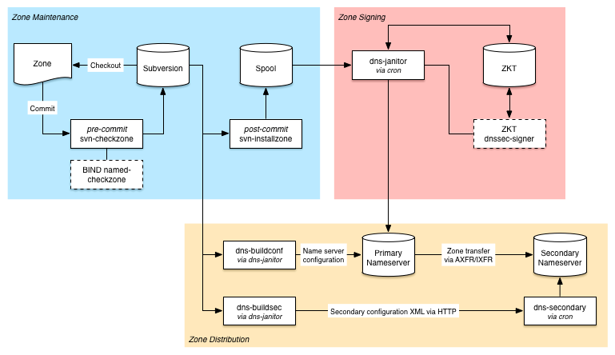

# Subversion for DNS

This respository contains a toolkit for DNS zone management using subversion.

Code found here should be considered work-in-progress and may not work as you
expect, and you should always test carefully before any production use.

N.B.: If it breaks, you get to keep both pieces.

## Basic Data Flow

1. All zone files are stored in a Subversion repository.

2. A subversion pre-commit hook (called svn-checkzone) checks that the unsigned
zone is syntactically valid by calling named-checkzone.

3. A subversion post-commit hook (called svn-installzone) installs the unsigned
zone file into a spool directory (e.g. /var/spool/named).

4. a cron job (dns-janitor) moves any pending zone files from the spool
directory into ZKT (for signed zones) or directly into the BIND master
directory (for unsigned zones). unsigned zones are updated with a new SOA
serial when copied, while the SOA serial for signed zones are handled by ZKT.
removed files are deleted automatically.

5. dns-janitor executes ZKT to do the signing and installs any updated zone
file into the BIND master directory.

6. Finally, named is notified of any changes zones using rndc.

## Fancy Graphics

## See Also

- https://github.com/kirei/dper

## To Do

The DNSSEC signer (ZKT) should be replaced by something better, e.g. OpenDNSSEC
or ISC BIND with online signing.
